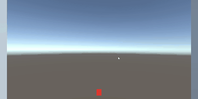

## ゲームをプレイ(全画面表示で遊んでください)

**[ここをクリックしてブラウザでゲームをプレイ](https://Es4da.github.io/CubeGame/)**

## 概要
Unityで作成した、上から降ってくる障害物を避けるシンプルなアクションゲームです。
UnityとC#の基礎を学びながら、ゲーム開発の一連の流れを体験するために制作しました。

## 主な機能
* **プレイヤー操作**: 左右移動とジャンプ
* **ゲームサイクル**: タイトル → ゲーム本編 → ゲームオーバーの画面遷移
* **障害物**: 空からランダムな位置に自動で生成・落下
* **当たり判定**: プレイヤーと障害物の衝突検知
* **パフォーマンス管理**: 画面外に落ちた不要なオブジェクトの自動削除機能

## 開発で学んだこと
* `Rigidbody` を使った物理演算ベースのキャラクター制御
* `Prefab` を利用したオブジェクトの動的生成
* `SceneManager` を用いたゲームシーンの管理方法
* `TextMeshPro` での日本語フォントの扱い方
* Git/GitHubを利用したバージョン管理
